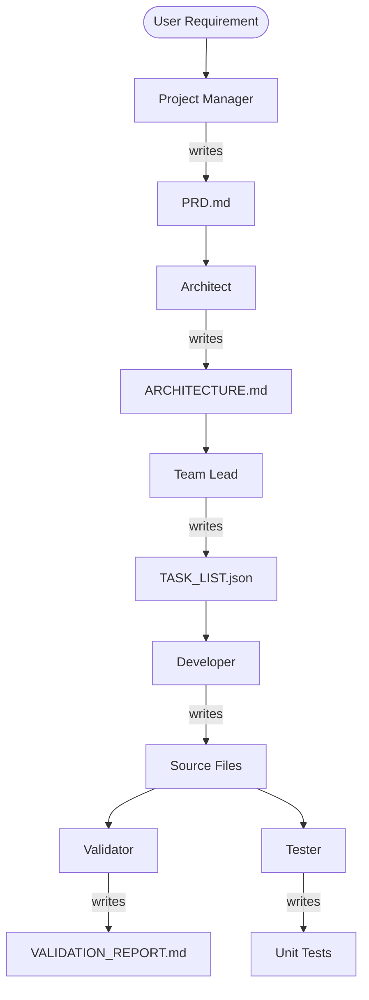

# AI_Company_prototype--->NeoForge AI 🚀

NeoForge AI is a specialized autonomous software development system designed to transform high-level human requirements into fully functional, production-ready codebases. It utilizes a multi-agent orchestration pattern to ensure high reliability and code quality.

## ✨ Features

-   **Autonomous Orchestration**: Automatically manages the end-to-end development lifecycle from requirement to deployment-ready code.
-   **Multi-Agent Architecture**: Discrete AI agents specialists (PM, Architect, Team Lead, Developer, Validator, Tester) collaborate to build your project.
-   **Reliable File Generation**: Engineered to produce complete, runnable files without placeholders or "TODO" comments.
-   **Real-time Visualization**: Built-in dashboard to monitor agent activity, task focus, and system logs live.
-   **Isolated Project Environments**: Every new requirement is built in its own timestamped directory under `projects/`.

## 🏗️ Architecture

NeoForge AI operates on a linear, highly structured pipeline:



### Agents Roles:
-   **Project Manager**: Distills user requirements into a formal PRD.
-   **Architect**: Defines the tech stack and folder structure.
-   **Team Lead**: Breaks down the architecture into specific, actionable implementation tasks.
-   **Developer**: Writes complete, high-quality code for every file in the task list.
-   **Validator**: Performs a critical review of the generated code (CRITICAL/ADVISORY/NITPICK).
-   **QA Tester**: Writes comprehensive unit tests using `pytest`.

## 🚀 Getting Started

### Prerequisites

-   Python 3.10+
-   Groq API Key (defaulting to Llama-3.3-70B) or OpenAI-compatible endpoint.

### Installation

1.  **Clone the repository**:
    ```bash
    git clone <repository-url>
    cd AI_company
    ```

2.  **Set up Virtual Environment**:
    ```bash
    python -m venv .venv
    source .venv/bin/activate  # On Windows: .venv\Scripts\activate
    ```

3.  **Install Dependencies**:
    ```bash
    pip install -r requirements.txt
    ```

4.  **Configure Environment**:
    Create a `.env` file in the root directory:
    ```env
    GROQ_API_KEY=your_api_key_here
    OPENAI_MODEL_NAME=groq/llama-3.3-70b-versatile
    ```

### Usage

Run the orchestrator with your project requirement:

```bash
python main.py "Create a classic Snake game in Python using Pygame"
```

The system will:
1.  Initialize the project in `projects/snake_game_<timestamp>/`.
2.  Start the visualization server.
3.  Execute the agent pipeline.

## 📊 Visualization Dashboard

While NeoForge AI is running, you can monitor progress in real-time:

-   **URL**: `http://127.0.0.1:8000`
-   **Features**: View which agent is currently active, what task they are working on, and the latest internal logs.

## 📂 Project Structure

```text
.
├── agents/             # Agent definitions and logic
├── core/               # Orchestrator, LLM runner, and FS utilities
├── projects/           # Output directory for generated projects
├── viz/                # Fast API / WebSocket visualization server
├── main.py             # Entry point
├── requirements.txt    # System dependencies
└── .env                # API configuration
```

## 📄 License

Feel free to use and upgrade the project with your Knowledge.

